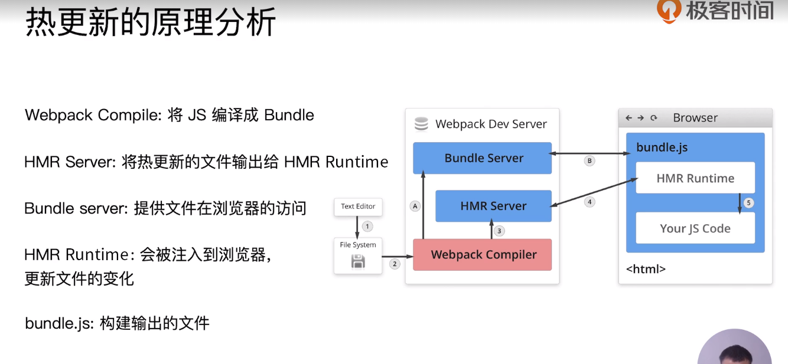

# webpack

## 初识webpack

webpack 官方默认配置文件：webpack.config.js

可以通过webpack --config 来修改配置文件

生产环境：
```js
webpack --config prod.js
```
开发环境
```js
webpack --config dev.js
```

配置组成：
webpack4
entry     打包的入口文件   默认 ./src/index.js 
output    打包的输出       默认 ./dist/main.js
mode      环境
module    loader配置
plugins   插件配置


## webpack安装

环境搭建

安装webpack和webpack-cli  因为在webpack4中将webpack和webpack-cli进行了分离

创建目录，然后初始化

```sh
mkdir webpack-demo
cd webpack-demo
npm init -y
```
安装webpack和webpack-cli
```sh
npm i webpack webpack-cli -D
```

检查是否安装成功:

```sh
# webpack 的版本
./node_modules/.bin/webpack -v  
```

## webpack demo  一个最简单的例子

webpack demo

运行打包

```sh
./node_modules/.bin/webpack
```

从node_modules/.bin/的文件夹下找到webpack这个打包命令来打包

## 通过npm script运行webpack

通过 `npm run build` 来进行构建

原理是：

模块局部安装会在`node_modules/.bin` 目录创建软链接
(感觉像是npm link 的作用?)

# webpack 基础用法

## entry

打包入口

依赖图的入口是 entry

可以根据entry 去查找依赖 生成依赖图

单入口

是一个字符串

```js
module.exports = {
  entry: './src/index.js'
}
```

多入口

是一个对象

```js
module.exports = {
  entry: {
    app: './src/app.js',
    adminApp: './src/adminApp.js'
  }
}
```

## output

`Output`用来告诉webpack如何将编译后的文件输出到磁盘

单入口配置

```js
module.exports = {
  entry: './src/index.js',
  output: {
    filename: 'bundle.js',   // 文件名称
    path: __dirname + './dist'  // 文件的生成路径
  }
}
```

多入口配置

```js
module.exports = {
  entry: {
    app: './src/app.js',
    adminApp: './src/adminApp.js'
  },
  output: {
    filename:'[name].js',  // 通过占位符来确保文件名称的唯一
    path: __dirname + '/dist'  // 
  }
}
```

## loaders

webpack 开箱即用只支持js和json两种文件类型，通过loaders去支持其他文件类型并且把它们转化成有效的模块，并且可以添加到依赖图中。

loader本身是一个函数，接受源文件作文参数，返回转换的结果。

常用的loaders

|  名称   | 描述  |
|  ----  | ----  |
| babel-loader  | 转换ES6,ES7等js新特性语法 |
| css-loader  | 支持css文件的加载和解析 |
| less-loader  | 将less文件转成css |
| ts-loader  | 将ts转成js |
| file-loader  | 进行图片，字体等的打包 |
| raw-loader  | 将文件以字符串的形式导入(首屏资源内联可以使用) |
| thread-loader  | 多进程打包js和css |

loaders的用法

```js
const path = require('path')

module.exports = {
  output: {
    filename:'bundle.js',
  }
  module: {
    rules: [
      { 
        test: /\.txt$/, // test 执行匹配的规则  文件的匹配格式
        use: 'raw-loader' // 指定使用的loader名称
      }
    ]
  }
}

```

## plugins

（任务loader解决不了的问题都可以交给plugins）
插件用于`bundle`文件的优化，资源管理和环境变量的注入
作用于整个构建过程

常见的plugins

|名称|描述|
|----|----|
|CommonsChunkPlugin|将chunks相同的模块代码提取成公共js|
|CleanWebpackPlugin|清理构建产物|
|ExtractTextWebpackPlugin|将css从bundle文件中提取成一个独立的css文件|
|CopyWebpackPlugin|将文件或者文件夹拷贝到构建的输出目录|
|HtmlWebpackPlugin|创建html文件去承载输出的bundle|
|UglifyjsWebpackPlugin|压缩js|
|ZipWebpackPlugin|将打包的资源生成一个zip包|

plugins的用法

```js
const path = require('path')

module.exports = {
  output: {
    filename: 'bundle.js'
  },
  plugins: [
    new HtmlWebpackPlugin({  // 放到plugins数组里边使用
      template:'./src/index.html' 
    })
  ]
}
```
## mode

mode用来指定当前的构建环境是`production` ，`development` 还是`none`

设置mode 可以使用webpack内置的函数，默认值为production

mode的内置功能函数

|选项|描述|
|----|----|
|development|设置process.env.NODE_ENV的值为development，开启NamedChunksPlugin和NamedModulesPlugin|
|production|设置process.env.NODE_ENV的值为production，开启FlagDependencyUsagePlugin,FlagIncludeChunksPlugin，ModuleConcatenationPlugin,NoEmitOnErrorPlugin,OccurrenceOrderPlugin,SideEffectsFlagPlugin和TerserPlugin|
|none|不开启任何优化选项|

## 解析ES6 和JSX

解析es6

使用babel-loader

`
@babel/preset-env 用于解析 ES6、ES7等语法
@babel/preset-react 用于解析 React JSX
`

babel的配置文件： `.babelrc`
```js
{
  "presets": [
    "@babel/preset-env"
  ],
  "plugins": [
    "@babel/proposal-class-properties" // // 每一个对应一个功能
  ]
}
```

安装babel

```sh
npm i @babel/core @babel/preset-env babel-loader -D
```

配置.babelrc
```js
{
  "presets": [
    "@babel/preset-env"
  ]
}
```
在webpack.config.js中添加babel-loader

```js
module: {
  rules: [
    {
      test: '/.js$/',
      use: 'babel-loader'
    }
  ]
}
```

解析react

需要在.babelrc文件中增加react的babel preset配置

```js
{
  "presets": [
    "@babel/preset-env",
    "@babel/preset-react"   // react的babel-preset配置
  ],
  "plugins": [
    "@babel/proposal-class-properties"
  ]
}
```

配置.babelrc文件

```js
{
  "presets": [
    "@babel/preset-env",
    "@babel/preset-react"
  ]
}
```

这样可以解析jsx了


## 解析css 和 less

解析css

css-loader 用于加载.css文件，并且转成commonjs对象

style-loader将样式通过<style></style> 标签插入到head中

```js
  module.exports = {
    rules: [
      {
        test: /\.css$/,
        use: [ // 执行顺序是从右到左的  现将css文件解析成css 然后再将css传递给style-loader
          'style-loader',
          'css-loader'
        ]
      }
    ]
  }
```

解析less

less-loader就是将less转成css

安装

```sh
npm less less-loader -D
```

解析less只需在之前的基础上添加less-loader即可

```js
  module.exports = {
    rules: [
      {
        test: /\.less$/,
        use: [ // 执行顺序是从右到左的  现将css文件解析成css 然后再将css传递给style-loader
          'style-loader',
          'css-loader',
          'less-loader'
        ]
      }
    ]
  }
```

## 解析图片和字体

解析图片

file-loader： 用于处理文件

使用：

webpack.config.js中

```js
module: {
  rules: [
    {
      test: /\.(png|jpg|svg|gif|jpeg)$/,
      use: 'file-loader'
    }
  ]
}

```

字体文件也可以使用file-loader去解析

在webpack.config.js中增加loader配置规则

```js
module: {
  rules: [
    {
      test: /\.(woff|woff2|eot|ttf|otf)$/,
      use: 'file-loader'
    }
  ]
}

```

使用url-loader

url-loader也可以处理图片和字体
可以设置较小资源自动转成base64
(url-loader内部也是使用了file-loader)

在webpack.config.js中增加loader配置规则

```js
module: {
  rules: [
    {
      test: /\.(png|jpg|svg|gif|jpeg)$/,
      use: {
        loader: 'url-loader',
        options: {
          limit: 10240 // 如果图片大小小于10K  会被转成base64
        }
      }
    }
  ]
}

```

## 文件监听

文件监听是发生在源代码发生变化的时候，自动重新构建出新的输出文件

webpack 开启监听模式 有两种方式

- 启动webpack命令时，带上  --watch 参数  // 浏览器不会自动刷新

- 在配置webpack.config.js中设置watch:true

使用方式一 

在package.json文件中添加script
```json
  "script": {
    "build":"webpack"
    "watch":"webpack --watch"
  }
```
缺点是浏览器不会自动刷新，需要手动刷新浏览器

文件监听的原理分析：

**轮询判断文件的最后编辑时间是否变化**

某个文件发生了变化，并不会立刻告诉监听者，而是先缓存起来 等 aggregateTimeout

```js
module.export = {
  // 默认false 不开启
  watch: true,
  // 只有开启监听模式  watchOptions才有意义
  watchOptions: { 
    // 默认为空，不监听的文件或者文件夹  支持正则匹配
    ignored: /node_modules/,
    // 监听到变化发生后会等300ms再去执行， 默认300ms
    aggregateTimeout: 300,
    // 判断文件是否发生变化通过不停询问系统指定文件有没有变化实现的，默认时间是每秒问1000次
    poll: 1000
  }
}
```

## webpack热更新

热更新

webpack-dev-server

WDS不刷新浏览器
WDS不输出文件，而是放在内存中
使用HotModuleReplacementPlugin插件（webpack内置的插件）

在开发环境中使用

安装webpack-dev-server

```sh
npm i webpack-dev-server -D
```
:::warning
webpack-cli 4.x版本和 webpack-dev-server 3.x版本不兼容
这里我使用的版本是
```sh
  "webpack-cli": "^4.7.2",
  "webpack-dev-server": "^3.11.2"
```
导致一直报错 `Error: Cannot find module 'webpack-cli/bin/config-yargs'`

解决办法

卸载webpack-cli,安装3.x版本
```sh
npm i webpack-cli@3.3.12 -D
```
:::

webpack.config.js

因为热更新是在开发环境中使用的,所以要修改mode

`HotModuleReplacementPlugin` 是webpack内置的一个plugin，

```js
mode: "development",
  plugins: [
    new webpack.HotModuleReplacementPlugin()
  ],
  // 开发配置
  devServer: {
    // 基础目录
    contentBase: './dist',
    // 开启热更新
    hot: true
  },
```
在package.json中增加

```json
  "script": {
    "build":"webpack"
    "dev":"webpack-dev-server --open"
  }
```

热更新： 使用webpack-dev-middleware

WDM将webpack输出的文件传输给服务器

适用于灵活的定制场景

**热更新的原理分析：**

Webpack Compile: 将JS编译成Bundle
HMR Server: 将热更新的文件输出给HMR Runtime
Bundle server: 提供文件在浏览器的访问
HMR Runtime: 会被注入到浏览器，更新文件的变化
bundle.js: 构建输出的文件



首先是Webpack Compiler 将你的代码文件编译成bundle.js, Bundle Server 是将你编译成的bundle.js转成服务端的形式访问(以这种`localhost:8080/dist/index.js`格式访问，如果不使用这种方式的话是以文件目录的形式访问的)，HMR server是将热更新的文件传输给HMR Runtime， HMR Runtime是在开发的打包阶段将热更新的文件注入到bundle.js中，HMR Runtime会在浏览器和服务器之间建立一个链接，这个链接是websocket 

## 文件指纹

文件打包之后的后缀
用途
版本管理

文件指纹如何生成

Hash: 和整个项目的构建相关，只要项目有修改，整个项目构建的hash值就会改变
ChunkHash: 和webpack打包的chunk有关，不同的entry会生成不同的chunkhash值
ContentHash: 根据文件内容来定义hash，文件内容不变，则contentHash不变

Chunk: 可以理解为一个模块

JS的文件指纹设置

设置output的filename，使用[chunkhash]

```js
output: {
  filename: '[name][chunkhash:8].js',  // 8位的chunkhash
  path: __dirname  + '/dist'
}
```

CSS文件的指纹设置

MiniCssExtractPlugin 将css-loader的css提取出来生成一个css文件

设置MiniCssExtractPlugin的filename，使用[contenthash]

```js
  plugins: [
    new MiniCssExtractPlugin({
      filename: `[name][contenthash:8].css`
    })
  ]
```

图片的文件指纹设置

设置file-loader 的name，使用[hash]

|占位符名称|含义|
|----|----|
|[ext]|资源后缀名|
|[name]|文件名称|
|[path]|文件的相对路径|
|[folder]|文件所在的文件夹|
|[contenthash]|文件的内容hash，默认是md5生成|
|[hash]|文件内容的Hash，默认是md5生成|
|[emoji]|一个随机的指代文件内容的emoji|

```js
module: {
  rules: [
    test: /\.(png|svg|jpg|gif)$/,
    use: [
      {
        loader: 'file-loader',
        options: {
          name: 'img/[name][hash:8].[ext]'
        }
      }
    ]
  ]
}
```

md5默认hash32位，[hash:8] 指的是取前8位

## 代码压缩

HTML 压缩
Css  压缩
JS   压缩

JS的文件压缩

webpack4内置了uglifyjs-webpack-plugin插件，打包是经过压缩的

CSS文件的压缩

使用optimize-css-assets-webpack-plugin  同时使用cssnano

cssnano css的预处理器

```js
plugins: [
  new OptimizeCssAssetsWebpackPlugin({
    assetNameRegExp:/\.css$/g,
    cssProcessor:require('cssnano')
  })
]
```

html文件的压缩

修改html-webpack-plugin，设置压缩参数

```js
plugins: [
  new HtmlWebpackPlugin({
    template: path.join(__dirname, 'src/search.html'),
    filename: 'search.html',
    chunks: ['search'],
    inject: true, // css js 会自动注入
    minify: {
      html5: true,
      collapseWhitespace: true, // 合并空格
      preserveLineBreaks: false,
      minifyCSS: true,
      minifyJS: true,
      removeComments: false
    }
  })
]
```

# 进阶用法

## 清理构建产物

方法一：
 
通过npm scripts 清理构建目录

```sh
rm -rf ./dist && webpack
rimraf ./dist && webpack （rimraf  一个库）
```

方法二：

clean-webpack-plugin

默认会删除output指定的输出目录

```js
plugins: [
  new CleanWebpackPlugin()
]
```

## 补全css前缀


PostCSS 插件autoprefixer 自动补齐CSS3前缀 (根据Can i use 的规则)

```js
module.exports = {
  module: {
    rules: [
      {
        test: /\.less$/,
        use: [
          'style-loader',
          'css-loader',
          'less-loader',
          {
            loader: 'postcss-loader',
            options: {
              plugins: ()=> [
                require('autoprefixer')({
                  browsers: [
                    'last 2 version', // 兼容到最近的两个版本
                    '> 1%',  // 用户占比
                    'iOS 7'  // 兼容到ios7
                  ]
                })
              ]
            }
          }
        ]
      }
    ]
  }
}
```

视频中用的是webpack4.x的版本这样设置直接成功了，我这里是webpack5的版本，设置了之后报错，有人说是兼容性问题，设置了兼容性之后还是没有自动补全，回头再研究吧

## rem转换

移动端CSS px自动转成rem

使用px2rem

页面渲染是设置根元素的font-size值，可以使用手淘的lib-flexible库

px2rem是将你写的px 自动转成rem
lib-flexible是设置根元素的font-size的值

```
npm i -S lib-flexible

npm i -D px2rem
```

使用的话在入口引入lib-flexible.js

在webpack.dev.js中设置

```js
module.exports = {
  module: {
    rules: [
      {
        test: /\.less$/,
        use: [
          'style-loader',
          'css-loader',
          'less-loader',
          {
            loader: 'px2rem-loader',
            options: {
              remUnit: 75, // 相对于rem的单位
              remPrecision: 8 // 小数点后边的位数
            }
          }
        ]
      }
    ]
  }
}
```

## 资源内联

资源内联的意义:

代码层面：

- 页面框架的初始化脚本
- 上报相关打点（css初始化， js初始化）
- css内联避免页面闪动

请求层面：减少HTTP网络请求

- 小图片或者字体内联(url-loader)

HTML和JS内联

使用raw-loader

raw-loader内联html

<!-- 将meta标签内联到页面中 -->

```html
<script>${require('raw-loader!babel-loader!./meta.html')}</script>
```

raw-loader内联JS

```html
<script>${require('raw-loader!babel-loader!../node_modules/lib-flexible')}</script>
```

使用0.5.1的版本  最新版本有问题(视频提示)

CSS内联

方案一：借助style-loader
方案二：html-inline-css-webpack-plugin

方案一的使用方法：

```js
module.exports = {
  module: {
    rules: [
      {
        test: /\.less$/,
        use: [
          // 'style-loader',
          {
            loader: 'style-loader',
            options: {
              insertAt: 'top', // 样式插入到<head>
              singleton: true // 将所有的style标签合成一个
            }
          }
          'css-loader',
          'less-loader',
        ]
      }
    ]
  }
}
```

## 多页面打包

多页面应用(MPA)概念

每一次页面跳转的时候，后台服务器都会返回一个新的html文档，这种类型的网站也就是多页面网站，也叫多页面应用

多页面打包的基本思路

每个页面都对应一个entry,  一个html-webpack-plugin

缺点：每次新增或者删除页面都需要修改webpack配置

利用glob.sync

设置成统一的目录格式

```js
entry: glob.sync(path.join(__dirname, './src/*/index.js')) // 同步的方式获取文件
```

写一个方法导出entry和htmlWebpackPlugins

```js
const setMPA = () => {
  const entry = {}
  const htmlWebpackPlugins = []
  const entryFiles = glob.sync(path.join(__dirname, './src/*/index.js'))
  Object.keys(entryFiles).map((index)=> {
    const entryFile = entryFiles[index]
    const match = entryFile.match(/src\/(.*)\/index\.js/)  // 获取文件名称
    const pageName = match && match[1]
    entry[pageName] = entryFile // 设置入口文件
    htmlWebpackPlugins.push(
      new HtmlWebpackPlugin({
        template: path.join(__dirname, `./src/${pageName}/index.html`),
        filename: `${pageName}.html`,
        chunks: [`${pageName}`],
        inject: true,
        minify: {
          html5: true,
          collapseWhitespace: true,
          preserveLineBreaks: false,
          minifyCSS: true,
          minifyJS: true,
          removeComments: false
        }
      })
    )
  })
  return {
    entry,
    htmlWebpackPlugins
  }
}
```

## 使用source map

作用：通过source map 定位到源代码

可以查看阮一峰老师的文章[http://www.ruanyifeng.com/blog/2013/01/javascript_source_map.html]

开发环境开启，线上环境关闭

- 线上排查问题的时候可以将sourcemap上传到错误监控系统

sourcemap 关键字

eval: 使用eval包裹模块代码
source map: 产生.map文件
cheap: 不包含列信息
inline: 将.map作为DataURI嵌入，不单独生产.map文件
module: 包含loader的sourcemap

[sourcemap类型](./static/sourcemap-type.jpg)


## 提取页面公共资源

1.基础库分离

- 思路： 将react, react-dom基础包通过cdn引入，不打入bundle中

- 方法： 使用html-webpack-externals-plugin

[基础库分离](./static/cdn-react.jpg)

```js
module.exports = {
  plugins:[
    new HtmlWebpackExternalsPlugin({
      externals: [
        {
          module: 'react',
          entry: 'https://lib.baomitu.com/react/17.0.2/umd/react.production.min.js',
          global: 'React'
        },
        {
          module: 'react-dom',
          entry: 'https://lib.baomitu.com/react-dom/17.0.2/umd/react-dom.production.min.js',
          global: 'ReactDom'
        }
      ]
    })
  ]
}
```

我在打包的过程中发现的问题

- html没有引入cdn链接，打包之后直接引入了，并且引入了两次造成了重复(猜测的原因可能是插件自动引入了或者是webpack新增的特性)
- **umd和cjs的区别 **


2.利用SplitChunksPlugin进行公共脚本分离

SplitChunksPlugin进行公共脚本分离的意义是什么？

webpack4内置的，代替CommonsChunksPlugin插件

chunks参数说明：

- async 异步引入的库进行分离(默认)
- initial 同步引入的库进行分离
- all 所有的库都进行分离(推荐)

```js
module.export = {
  optimization: {
    splitChunks: {
      chunks: 'all',
      minSize: 30000, // 
      maxSize: 0,
      minChunks: 1, // 最小使用次数
      maxAsyncRequests: 5, // 
      maxInitialRequests: 3,
      automaticNameDelimiter: '~',
      name: true,
      cacheGroups: {
        vendors: {
          test: /[\\/]node_modules[\\/]/, // 匹配要分离的包
          priority: -10
        }
      }
    }
  }
}
```
在项目中的应用

```js
module.exports = {
  optimization: {
    splitChunks: {
      cacheGroups: {
        commons: {
          test: /(react|react-dom)/,
          name: 'vendors',
          chunks: 'all'
        }
      }
    }
  },
}
```
<!-- 特别主要的一点-->

这是将公共包处理出来了，但是没有在html中进行引用，所以需要在html中引用。

```js
new HtmlWebpackPlugin({
  template: path.join(__dirname, `./src/${pageName}/index.html`),
  filename: `${pageName}.html`,
  chunks: ['vendors', `${pageName}`], // 引用vendors
  inject: true,
  minify: {
    html5: true,
    collapseWhitespace: true,
    preserveLineBreaks: false,
    minifyCSS: true,
    minifyJS: true,
    removeComments: false
  }
})
```


## tree shaking 摇树优化

概念： 1个模块可能有多个方法，只要其中的某个方法使用到了，这整个文件到会被打到bundle里面去，tree shaking就是只把用到的方法打入bundle，没用到的方法会在uglify阶段被擦除掉

使用: webpack默认支持，在.babelrc里设置 `modules: false` 即可
- production mode的情况下默认开启

要求：必须是es6的语法，cjs的方式不支持

**DCE(Elimination)**

代码不会被执行，不可到达
代码执行的结果不会被用到
代码只会影响死变量(只写不读)

**Tree-shaking原理**

(对模块代码进行静态分析，而不是运行时去分析)

利用ES6模块的特点：

- 只能作为模块顶层的语句出现
- import的模块名只能是字符串常量
- import binding 是immutable的

代码擦除： uglify阶段删除无用代码

**three shaking的代码必须是纯函数，如果有副作用，就会失效**

## Scope Hoisting的使用和原理分析


现象： 构建后的代码存在大量闭包代码

会导致的问题：

大量函数闭包包括代码，导致体积增大(模块越多越明显)
运行代码时创建的函数作用域变多，内存开销变大

[模块转换分析](./static/module-translate.jpg)

模块转换的原因还是因为兼容性

模块在转换之后

-被webpack转换后的模块会带上一层包裹
-import会被转换成__webpack_require

进一步分析webpack的模块机制

分析：

- 打包出来的适应IIFE(匿名闭包)
- modules是一个数组，每一项都是一个模块初始化函数
- __webpack_require 用来加载模块，返回module.exports
- 通过WEBPACK_REQUIRE_METHOD(0)启动程序

scope hoisting 原理

原理：将所有模块的代码按照引用顺序放在一个函数作用域里，然后适当的重命名一些变量以防止变量名冲突

对比：通过scope hoisting 可以减少函数声明代码和内存开销

scope hoisting 使用

webpack mode 为production 默认开启

必须是ES6语法，CJS不支持

>可以简单的把scope hoisting理解为是把每个模块被webpack处理成的模块初始化函数整理到一个统一的包裹函数里，也就是把多个作用域用一个作用域取代，以减少内存消耗并减少包裹块代码，从每个模块有一个包裹函数变成只有一个包裹函数包裹所有的模块，但是有一个前提就是，当模块的引用次数大于1时，比如被引用了两次或以上，那么这个效果会无效，也就是被引用多次的模块在被webpack处理后，会被独立的包裹函数所包裹

## 代码分割

代码分割的意义：

对于大的web应用来讲，将所有的代码都放在一个文件中显然是不够有效的，特别是当你的某些代码块是在某些特殊的时候才会被使用到。webpack有一个功能就是将你的代码库分割成chunks(语块)，当代码运行到需要他们的时候再进行加载。

适用的场景：

- 抽离相同代码到一个共享块
- 脚本懒加载，使得初始下载的代码更小

懒加载JS脚本的方式

- CommonJS: require.ensure
- ES6: 动态import (目前还没有原生支持，需要babel转换)

**如何适用动态import？**

安装babel插件

```sh
npm i @babel/plugin-syntax-dynamic-import -D
```

在`.babelrc`文件中添加

```js
{
  "plugins": ["@babel/plugin-syntax-dynamic-import"]
}
```

使用的时候直接`import('./index.js')` 懒加载


## ESLint的必要性

有jslint，比较常用的是eslint

[团队指定规范](./static/eslint.jpg)

ESLint 如何执行落地

和CI/CD系统集成

和Webpack集成

配置`.eslintrc.js`

## webpack 打包库和组件

webpack除了可以用来打包应用，也可以用来打包js库

看large-number demo

## 在webpack中实现SSR打包

服务端渲染(SSR)是什么？

渲染： HTML + CSS + JS + Data -> 渲染后的HTML

服务端：

所有模板等资源都存储在服务端
内网机器拉取数据更快
一个HTML返回所有数据

[服务端渲染和客户端渲染的对比]('./static/ssr-1.jpg')

服务端渲染的核心是减少请求

**SSR的优势**

减少白屏事件
对于SEO更加友好

SSR的代码实现思路

服务端

- 使用react-dom/server 的renderToString方法将React组件渲染成字符串
- 服务端路由返回对应的模板

客户端

- 打包出针对服务端的组件

webpack ssr打包存在的问题

浏览器的全局变量(Node.js中没有document，window)

- 组件适配： 将不兼容的组件根据打包环境进行适配
- 请求适配： 将fetch或者ajax发送请求的写法写成isomorphic-fetch 或者axios

样式问题(Node.js无法解析css)

- 方案一: 服务端打包通过ignore-loader忽略掉css的解析
- 方案二：将style-loader替换成isomorphic-style-loader

如何解决样式不显示的问题？

使用打包出来的浏览器端html为模板(样式已经添加进去)
设置占位符 动态插入组件

首屏数据如何处理？

服务端获取数据(用占位符，数据放在script上)
替换占位符