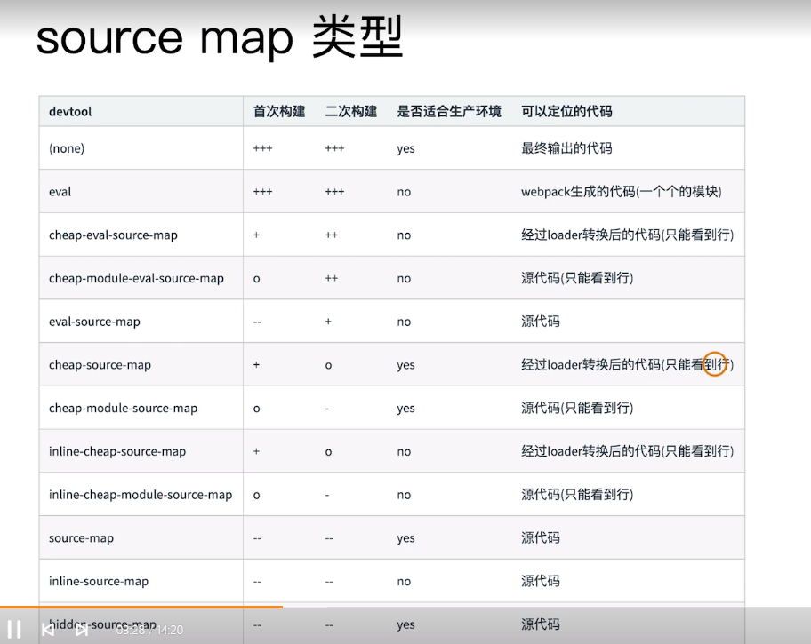

webpack中几大常用模块的作用

# enrty

入口的配置文件，可以是 `字符串`， `对象`，`数组`

多入口文件的话，可以使用数组配置

# output

打包出口的文件配置，可以配置文件打包之后处输出的目录
还可以配置文件的hash值

# module

webpack-loader的配置，在rules中配置各种loader
这里要注意loader的调用顺序是从右往左

```js
module.exports = {
  module: {
    rules: []
  }
}
```

# pugins

是一个数组，所需要的插件都在`plugins`数组里边配置

```js
module.exports = {
  plugins: [
  
  ]
}
```

# mode

环境变量，有三种默认的环境变量：`none`，`development`，`production`

webpack默认的环境变量是`production`

# sourceMap

sourceMap，是指源代码于构建后文件的映射，通常在开发环境开启，生产环境关闭，根据不同的环境设置不同的类型

sourceMap的类型：



# stats

`stats`

# resolve

模块解析，我们在工作中用的比较多的就是变量配置

常用的有以下个值

```js
module.exports = {
  resolve: {
    extensions: ['json', 'js'] // 我们平时引入js不带文件后缀，就是在这里设置的
    alias: {
      '@': path.resolve(__dirname, 'src/') // 记住这里配置的时候一定要带`/`， 不然不起作用
    }
  }
}
```

`extensions` 表示自动解析的文件后缀名。默认为`js`和`json`


# devServer

开发环境的配置，平时开发中的关于服务的各种配置都在这里

```js
module.exports = {
  devServer: {
    port: 9999, // 端口号
    progress：true, // 在浏览器中以百分比显示编译进度
    hot: true,  // 是否开启webpack的热模块替换
    open: true, // 是否自动打开浏览器
    proxy: {}  // 代理
  }
}
```

# Optimization

优化，常用的就是在打包阶段的分包优化

# Cache

通过缓存webpack模块和chunk来提交构建速度

# externals

外部扩展，我们常用到的就是用cdn引入，在externals里边配置，不将这些文件打包

# Devtool

# watch